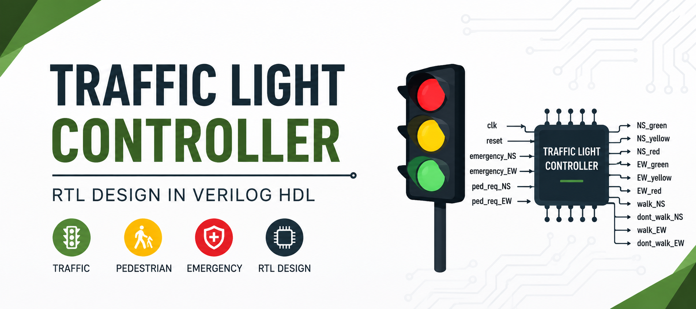
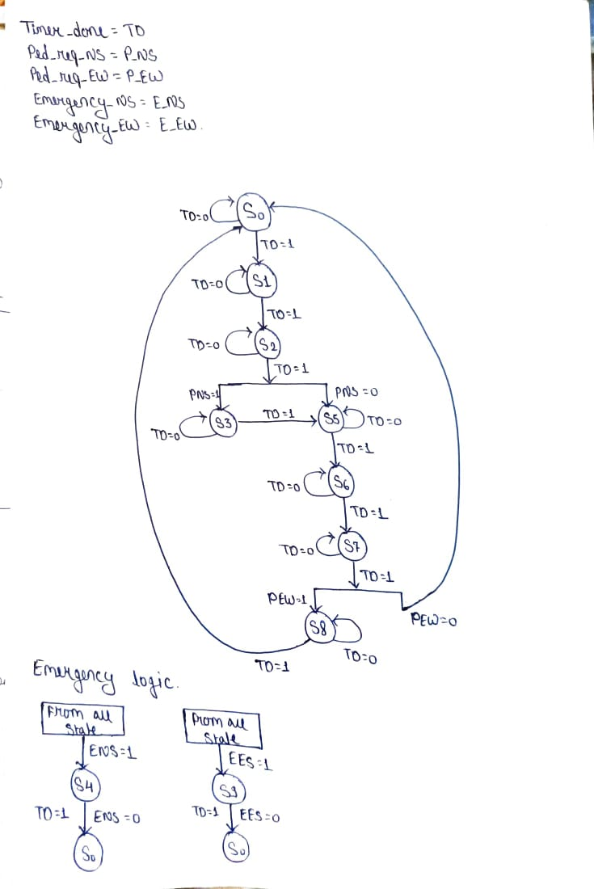
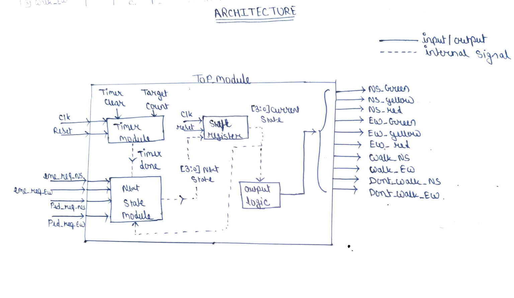
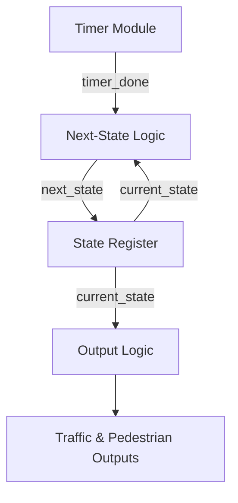
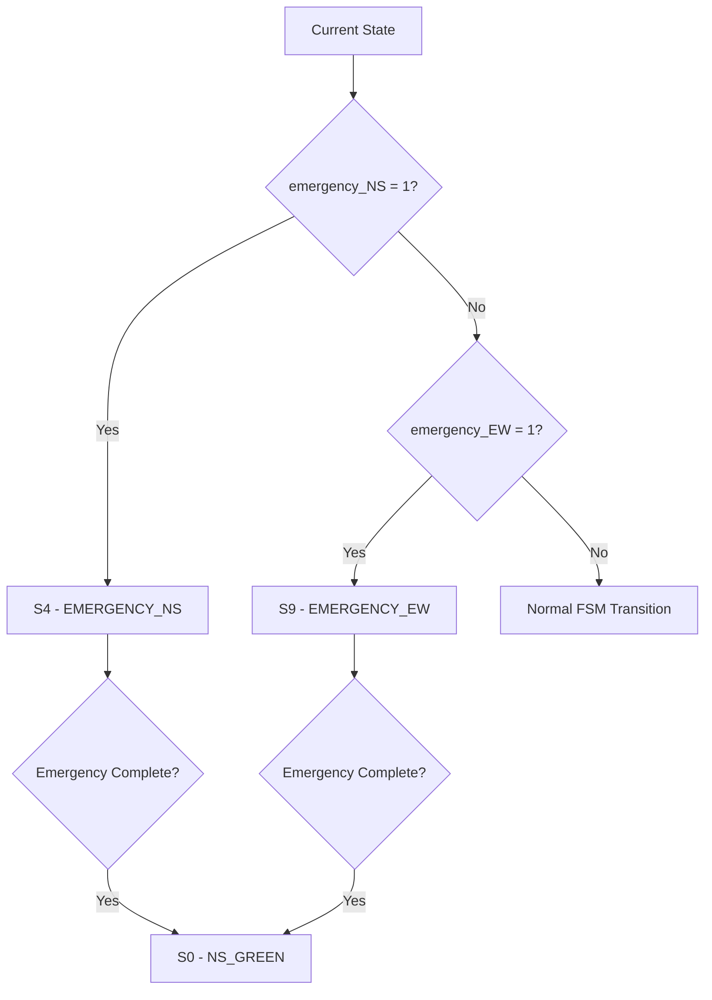
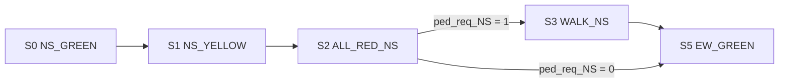
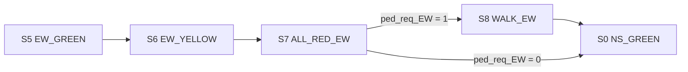
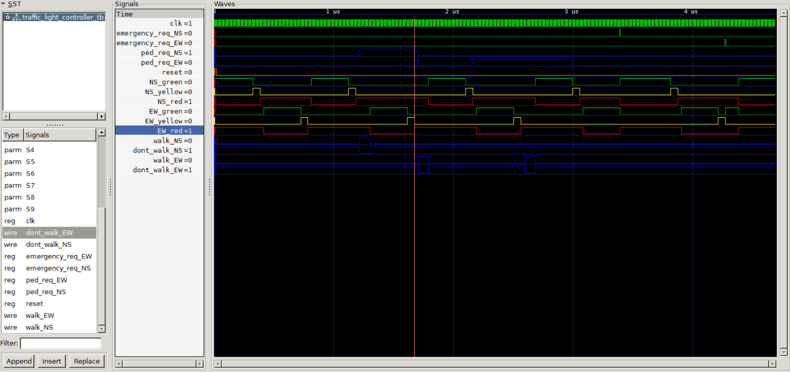

# Traffic Light Controller — RTL Design in Verilog HDL

<p align="center">
  
</p>

A modular **Traffic Light Controller designed in Verilog HDL using a Moore Finite State Machine (FSM)**.

The controller manages traffic signals for a two-way intersection between **North-South (NS)** and **East-West (EW)** directions. The design includes timer-controlled state transitions, pedestrian crossing requests, emergency vehicle priority, dedicated all-red safety states, and complete RTL-level functional verification.

The project was developed phase-by-phase, starting from system requirements and FSM design and progressing through RTL implementation, module-level verification, top-level integration, waveform analysis, and final functional verification.

---

## Table of Contents

* [Project Overview](#project-overview)
* [Key Features](#key-features)
* [System Specifications](#system-specifications)
* [FSM State Diagram](#fsm-state-diagram)
* [RTL Architecture](#rtl-architecture)
* [FSM Design](#fsm-design)
* [State Table](#state-table)
* [State Transition Table](#state-transition-table)
* [Output Truth Table](#output-truth-table)
* [Module-Wise Interface](#module-wise-interface)
* [Emergency Priority Logic](#emergency-priority-logic)
* [Pedestrian Request Handling](#pedestrian-request-handling)
* [Verification](#verification)
* [Simulation](#simulation)
* [Development Flow](#development-flow)
* [Repository Structure](#repository-structure)
* [Tools Used](#tools-used)
* [Concepts Learned](#concepts-learned)
* [Future Work](#future-work)
* [Conclusion](#conclusion)
* [Support the Project](#support-the-project)

---

## Project Overview

The Traffic Light Controller is implemented as a **10-state Moore FSM**.

The controller manages two traffic directions:

* **North-South (NS)**
* **East-West (EW)**

It controls:

* Traffic lights for both directions
* Pedestrian crossing signals
* Emergency vehicle priority
* Timer-controlled state durations
* Safe all-red transition periods

The complete design is divided into independent RTL modules and integrated through a top-level module.

### Basic Traffic Flow

The normal traffic sequence is:

```text
NS_GREEN → NS_YELLOW → ALL_RED_NS
                              ↓
                         EW_GREEN
                              ↓
                         EW_YELLOW
                              ↓
                         ALL_RED_EW
                              ↓
                          NS_GREEN
```

Pedestrian requests are evaluated during the corresponding all-red states.

---

## Key Features

* Moore FSM architecture
* 10-state traffic controller
* 4-bit FSM state encoding
* Timer-controlled state transitions
* North-South traffic control
* East-West traffic control
* NS pedestrian request
* EW pedestrian request
* NS emergency request
* EW emergency request
* Emergency priority logic
* Dedicated all-red safety states
* Modular RTL architecture
* Combinational next-state logic
* Moore output decoder
* Safe/default FSM state handling
* Independent module-level testbenches
* Complete top-level functional testbench
* GTKWave waveform verification
* Corner-case testing
* Verilog HDL implementation

---

# System Specifications

## External Inputs

| Signal         | Width | Description                        |
| -------------- | ----: | ---------------------------------- |
| `clk`          | 1 bit | System clock                       |
| `reset`        | 1 bit | Controller reset                   |
| `emergency_NS` | 1 bit | Emergency request for North-South  |
| `emergency_EW` | 1 bit | Emergency request for East-West    |
| `ped_req_NS`   | 1 bit | Pedestrian request for North-South |
| `ped_req_EW`   | 1 bit | Pedestrian request for East-West   |

## External Outputs

| Signal         | Width | Description                       |
| -------------- | ----: | --------------------------------- |
| `NS_green`     | 1 bit | North-South green signal          |
| `NS_yellow`    | 1 bit | North-South yellow signal         |
| `NS_red`       | 1 bit | North-South red signal            |
| `EW_green`     | 1 bit | East-West green signal            |
| `EW_yellow`    | 1 bit | East-West yellow signal           |
| `EW_red`       | 1 bit | East-West red signal              |
| `walk_NS`      | 1 bit | North-South pedestrian WALK       |
| `dont_walk_NS` | 1 bit | North-South pedestrian DON'T WALK |
| `walk_EW`      | 1 bit | East-West pedestrian WALK         |
| `dont_walk_EW` | 1 bit | East-West pedestrian DON'T WALK   |

## Internal Signals

| Signal          |  Width | Description                                              |
| --------------- | -----: | -------------------------------------------------------- |
| `current_state` | 4 bits | Current FSM state                                        |
| `next_state`    | 4 bits | Next FSM state                                           |
| `timer_count`   | 5 bits | Current timer count                                      |
| `timer_done`    |  1 bit | Indicates completion of the current state's target count |

---

# FSM State Diagram

The controller uses a **10-state Moore FSM** with 4-bit binary state encoding.

<p align="center">
  
</p>
---

# RTL Architecture

<p align="center">
  
</p>

The RTL design is divided into four major functional blocks:



### 1. Timer Module

The timer module:

* Counts clock cycles
* Receives the target count
* Supports reset
* Supports timer clear
* Generates `timer_done`
* Provides the internal `timer_count`

### 2. Next-State Logic

The next-state logic determines the next FSM state using:

* `current_state`
* `timer_done`
* `emergency_NS`
* `emergency_EW`
* `ped_req_NS`
* `ped_req_EW`

Emergency and pedestrian decisions are implemented directly inside this module.

Separate emergency and pedestrian RTL modules are therefore not required.

### 3. State Register

The state register:

* Stores the current FSM state
* Uses the system clock
* Handles reset
* Loads `next_state`

### 4. Output Logic

The output logic implements the Moore output decoder.

The outputs depend only on:

```text
current_state
```

This provides deterministic traffic and pedestrian outputs for every FSM state.

---

# FSM Design

## State Encoding

The controller uses a **4-bit binary state encoding**.

## State Table

| State | State Name     | Encoding  | Target Count |
| ----- | -------------- | --------- | -----------: |
| `S0`  | `NS_GREEN`     | `4'b0000` |           30 |
| `S1`  | `NS_YELLOW`    | `4'b0001` |            5 |
| `S2`  | `ALL_RED_NS`   | `4'b0010` |            2 |
| `S3`  | `WALK_NS`      | `4'b0011` |            8 |
| `S4`  | `EMERGENCY_NS` | `4'b0100` |           10 |
| `S5`  | `EW_GREEN`     | `4'b0101` |           30 |
| `S6`  | `EW_YELLOW`    | `4'b0110` |            5 |
| `S7`  | `ALL_RED_EW`   | `4'b0111` |            2 |
| `S8`  | `WALK_EW`      | `4'b1000` |            8 |
| `S9`  | `EMERGENCY_EW` | `4'b1001` |           10 |

---

# State Transition Table

The finalized next-state logic follows the transition table below.

### NS Side

| Present State | Condition     | Next State |
| ------------- | ------------- | ---------- |
| `S0`          | `ENS=1`       | `S4`       |
| `S0`          | `EES=1`       | `S9`       |
| `S0`          | `TD=0`        | `S0`       |
| `S0`          | `TD=1`        | `S1`       |
| `S1`          | `ENS=1`       | `S4`       |
| `S1`          | `EES=1`       | `S9`       |
| `S1`          | `TD=0`        | `S1`       |
| `S1`          | `TD=1`        | `S2`       |
| `S2`          | `ENS=1`       | `S4`       |
| `S2`          | `EES=1`       | `S9`       |
| `S2`          | `TD=0`        | `S2`       |
| `S2`          | `TD=1, PNS=1` | `S3`       |
| `S2`          | `TD=1, PNS=0` | `S5`       |
| `S3`          | `ENS=1`       | `S4`       |
| `S3`          | `EES=1`       | `S9`       |
| `S3`          | `TD=0`        | `S3`       |
| `S3`          | `TD=1`        | `S5`       |

### EW Side

| Present State | Condition     | Next State |
| ------------- | ------------- | ---------- |
| `S5`          | `ENS=1`       | `S4`       |
| `S5`          | `EES=1`       | `S9`       |
| `S5`          | `TD=0`        | `S5`       |
| `S5`          | `TD=1`        | `S6`       |
| `S6`          | `ENS=1`       | `S4`       |
| `S6`          | `EES=1`       | `S9`       |
| `S6`          | `TD=0`        | `S6`       |
| `S6`          | `TD=1`        | `S7`       |
| `S7`          | `ENS=1`       | `S4`       |
| `S7`          | `EES=1`       | `S9`       |
| `S7`          | `TD=0`        | `S7`       |
| `S7`          | `TD=1, PEW=1` | `S8`       |
| `S7`          | `TD=1, PEW=0` | `S0`       |
| `S8`          | `ENS=1`       | `S4`       |
| `S8`          | `EES=1`       | `S9`       |
| `S8`          | `TD=0`        | `S8`       |
| `S8`          | `TD=1`        | `S0`       |

### Emergency States

| Present State | Condition     | Next State |
| ------------- | ------------- | ---------- |
| `S4`          | `ENS=1`       | `S4`       |
| `S4`          | `TD=1, ENS=0` | `S0`       |
| `S9`          | `EES=1`       | `S9`       |
| `S9`          | `TD=1, EES=0` | `S0`       |

### Transition Priority

The next-state logic checks conditions in this order:

```text
Emergency_NS
      ↓
Emergency_EW
      ↓
Timer / Normal Transition
      ↓
Pedestrian Request
```

This makes the emergency behavior deterministic and gives **North-South emergency priority over East-West emergency** when both are active.

---

# Output Truth Table

The output logic is a Moore decoder, so the outputs depend only on the current state.

| State | NS Green | NS Yellow | NS Red | EW Green | EW Yellow | EW Red | Walk NS | Don't Walk NS | Walk EW | Don't Walk EW |
| ----- | -------: | --------: | -----: | -------: | --------: | -----: | ------: | ------------: | ------: | ------------: |
| `S0`  |        1 |         0 |      0 |        0 |         0 |      1 |       0 |             1 |       0 |             1 |
| `S1`  |        0 |         1 |      0 |        0 |         0 |      1 |       0 |             1 |       0 |             1 |
| `S2`  |        0 |         0 |      1 |        0 |         0 |      1 |       0 |             1 |       0 |             1 |
| `S3`  |        0 |         0 |      1 |        0 |         0 |      1 |       1 |             0 |       0 |             1 |
| `S4`  |        1 |         0 |      0 |        0 |         0 |      1 |       0 |             1 |       0 |             1 |
| `S5`  |        0 |         0 |      1 |        1 |         0 |      0 |       0 |             1 |       0 |             1 |
| `S6`  |        0 |         0 |      1 |        0 |         1 |      0 |       0 |             1 |       0 |             1 |
| `S7`  |        0 |         0 |      1 |        0 |         0 |      1 |       0 |             1 |       0 |             1 |
| `S8`  |        0 |         0 |      1 |        0 |         0 |      1 |       0 |             1 |       1 |             0 |
| `S9`  |        0 |         0 |      1 |        1 |         0 |      0 |       0 |             1 |       0 |             1 |

---

# Module-Wise Interface

| Module                     | Inputs                                                                                    | Outputs                        |
| -------------------------- | ----------------------------------------------------------------------------------------- | ------------------------------ |
| `timer`                    | `clk`, `reset`, `timer_clear`, `target_count`                                             | `timer_done`, `timer_count`    |
| `state_register`           | `clk`, `reset`, `next_state`                                                              | `current_state`                |
| `next_state_logic`         | `current_state`, `timer_done`, `emergency_NS`, `emergency_EW`, `ped_req_NS`, `ped_req_EW` | `next_state`                   |
| `output_logic`             | `current_state`                                                                           | Traffic and pedestrian outputs |
| `traffic_light_controller` | `clk`, `reset`, emergency requests, pedestrian requests                                   | Traffic and pedestrian outputs |

---

# Emergency Priority Logic

Emergency handling is implemented directly inside `next_state_logic.v`.

The controller first checks the NS emergency request and then the EW emergency request.


---

# Pedestrian Request Handling

Pedestrian requests are handled at the corresponding all-red states.

## North-South Pedestrian Request



The NS pedestrian request is evaluated after the NS traffic sequence reaches `S2`.

## East-West Pedestrian Request


The EW pedestrian request is evaluated after the EW traffic sequence reaches `S7`.

---

# Verification

The project was verified at both **module level and top level**.

## Module-Level Verification

Independent testbenches were created for:

* Timer
* State Register
* Next-State Logic
* Output Logic

Each block was verified independently before top-level integration.

## Top-Level Verification

The complete testbench verifies:

* Reset behavior
* Initial state
* Timer operation
* Normal state transitions
* Emergency NS request
* Emergency EW request
* Pedestrian NS request
* Pedestrian EW request
* Multiple requests
* Corner cases
* Output behavior
* Complete traffic sequence

## Final Verification Result

<p align="center">
  
</p>

The final verification confirms the integrated controller operates according to the defined FSM, timing, emergency, pedestrian, and output requirements.

### Block-Wise Verification

Individual verification results for the Timer, State Register, Next-State Logic, and Output Logic are available in the `Images/` directory.

Check the **`Images/` folder** for the block-wise verification waveforms and results.

---
# Simulation

The RTL design can be compiled and simulated using **Icarus Verilog** and the generated waveform can be analyzed using **GTKWave**.

## Compile

```bash
iverilog -o sim/traffic_light_controller.out rtl/traffic_light_controller.v rtl/timer.v rtl/state_register.v rtl/output_logic.v rtl/next_state_logic.v tb/traffic_light_controller_TB.v
```
### Run Simulation

```bash 
vvp sim/traffic_light_controller.out
```
#### Open GTKWave

```bash
gtkwave wave/traffic_light_controller.vcd
```
---

# Development Flow

| Phase | Module / Task                        | Status |
| ----: | ------------------------------------ | :----: |
|     1 | Project Requirement Analysis         |  DONE  |
|     2 | Traffic Signal Timing Analysis       |  DONE  |
|     3 | FSM Fundamentals                     |  DONE  |
|     4 | Define Inputs, Outputs & Constraints |  DONE  |
|     5 | State Identification                 |  DONE  |
|     6 | State Encoding                       |  DONE  |
|     7 | State Diagram Design                 |  DONE  |
|     8 | State Transition Table               |  DONE  |
|     9 | Output Truth Table                   |  DONE  |
|    10 | Overall RTL Architecture             |  DONE  |
|    11 | Timer Module Design                  |  DONE  |
|    12 | Timer Testbench                      |  DONE  |
|    13 | State Register Design                |  DONE  |
|    14 | State Register Testbench             |  DONE  |
|    15 | Next-State Logic                     |  DONE  |
|    16 | Output Logic                         |  DONE  |
|    17 | Emergency Priority Logic             |  DONE  |
|    18 | Pedestrian Request Logic             |  DONE  |
|    19 | Top Module Integration               |  DONE  |
|    20 | Complete Testbench                   |  DONE  |
|    21 | Waveform Analysis                    |  DONE  |
|    22 | Corner Case Testing                  |  DONE  |
|    23 | Documentation                        |  DONE  |
|    24 | GitHub Repository                    |  DONE  |

---

# Repository Structure

```text
Traffic-light-controller-RTL/
│
├── Images/
│   ├── banner.png
│   ├── architecture.jpg
│   ├── state_diagram.jpeg
│   ├── Timer_verifaction.png
│   ├── state_register_verification.png
│   ├── next_state_verification.png
│   ├── output_logic_verification.png
│   └── final_verification.png
│
├── rtl/
│   ├── timer.v
│   ├── state_register.v
│   ├── next_state_logic.v
│   ├── output_logic.v
│   └── traffic_light_controller.v
│
├── tb/
│   ├── timer_TB.v
│   ├── state_register_TB.v
│   ├── next_state_logic_TB.v
│   ├── output_logic_TB.v
│   └── traffic_light_controller_TB.v
│
├── sim/
│   ├── timer.out
│   ├── state_register.out
│   ├── next_state_logic.out
│   ├── output_logic.out
│   └── traffic_light_controller.out
│
├── wave/
│   ├── timer_wave.vcd
│   ├── state_register.vcd
│   ├── next_state.vcd
│   ├── output_logic.vcd
│   └── traffic_light_controller.vcd
│
├── LICENSE
└── README.md
```

---

# Tools Used

* **Verilog HDL** — RTL design
* **Icarus Verilog / VVP** — Compilation and simulation
* **GTKWave** — Waveform analysis
* **Git** — Version control
* **GitHub** — Repository management and documentation

---

# Concepts Learned

This project provided practical experience with:

* Finite State Machine design
* Moore FSM architecture
* State encoding
* `localparam` for FSM state definitions
* Combinational next-state logic
* Sequential state storage
* D flip-flop based state registers
* Counter and timer design
* Moore output decoding
* Emergency priority logic
* Pedestrian request handling
* Modular RTL architecture
* RTL module integration
* Testbench development
* Functional verification
* Waveform analysis
* Corner-case testing
* Safe/default FSM states
* Top-level RTL integration

---

# Future Work

## 4-Way Traffic Signal

Soon, this project will be extended from the current **2-way traffic controller to a 4-way traffic signal controller**.

The future version will expand the FSM and control architecture to manage four traffic directions along with their corresponding pedestrian and emergency requirements.

Planned improvements include:

* Four-way traffic management
* Expanded FSM architecture
* Additional pedestrian crossings
* Emergency handling for four directions
* More advanced traffic sequencing
* Extended timing control
* Expanded verification environment
* Additional safety conditions

The current project provides the RTL and FSM foundation for this future extension.

---

# Conclusion

This project demonstrates a complete RTL development and verification flow for a practical digital control system.

The design progressed through:

```text
Requirements
     ↓
FSM Design
     ↓
State Encoding
     ↓
State Transition Logic
     ↓
Timer Design
     ↓
Output Logic
     ↓
RTL Module Development
     ↓
Module-Level Verification
     ↓
Top-Level Integration
     ↓
Functional Verification
     ↓
Waveform Analysis
```

The final implementation is a **10-state Moore FSM-based Traffic Light Controller** with:

* Timer-controlled traffic sequencing
* NS and EW traffic signals
* NS and EW pedestrian control
* Emergency vehicle priority
* Dedicated all-red safety states
* Modular RTL architecture
* Independent module verification
* Complete top-level functional verification

This project establishes the foundation for the next version: a **4-way traffic signal controller**.

---

# ⭐ Support the Project

If you find this project useful or interesting, consider giving the repository a **star ⭐**.
